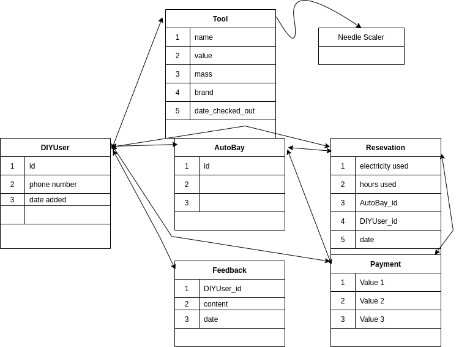

# Project Overview

## Hunter DIY Garage

A company that hosts several bays inside of an automotive garage.  Each Bay is complete with a lift and a toolbox with the basic fixings of automotive repair and replace.  Specialized tools will be available upon request.

### Problems

- Overbooking
- Missing Tools
- Payment
- Payment Refunds

### Features

- [ ] Book and pay in advance
- [ ] Track tool use hours
- [ ] Log tool checkout
- [ ] Refund canceled reservation if w/in cancellation policy guidelines
- [ ] Leave feedback

# Functionality

- HERO
Upon landing on hunterdiygarage.com there will be the hero section that will occupy 3/4 of 1080*1920 screen from header down.  

- HEADER
The header will, on the left, feature a linked logo that will redirect to the landing page from anywhere.  All users will see, after the logo, `reserve`, `contact`, and `about` buttons.  On the far right there will be `register` and `login` buttons.  Logged in user will see a `profile` button inserted before `reserve` and `logout` will replace `register` and `login`.  The header will survive every page.

- MAIN PAGE
The main page will feature pictures and information regarding the facility and its in-person features.  Welding, CNC, Lathe, etc...  Quotes and testimonies from previous customers will be elegantly scattered as the user scrolls down. 

- FOOTER
The footer will have information regarding the author of the site as well as clickable links.  The commerce and social media links will be `facebook`,`amazon`,`twitter`,and `instagram`.  The links to the `about`, `contact`, `rules`, `price`, and `cancellation policy` page will also be co-located in the footer.  The social media and commerce links will be on the right side of the footer whilst the other items will occupy the left half.  The footer will survive every page.

- OTHER PAGES
There are a dozen pages that could possibly be visited.  

Can only checkout tools if have a reservation. 

# Data Model

# Timeline

- [ ] Week 1
    - [X] Create DB
    - [X] Create all HTML pages
    - [ ] Input all styling
    
- [ ] Week 2
    - [X] Complete Hero section
    - [X] Create DB Models 
    - [X] All links functional

- [ ] Week 3
    - [ ] JS all the forms
    - [X] User login & logout functional
    - [ ] Backend fully functional 

- [ ] Week 4
    - [ ] Publish and self host (already purchased domain)

- [X] After
    - [X] Use a Calendar for picking the dates

# Installation

`pip install -r requirements.txt`

`python manage.py migrate`

`python manage.py runserver`

